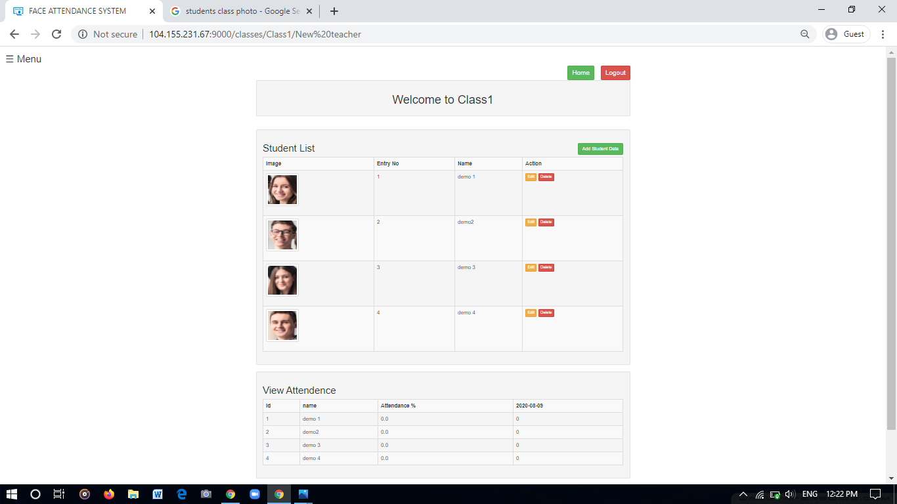

# Introduction

Item Name : Face Attendance System  
Item Version : v 1.0  
Developer : [Abhishek Kumar Gupta](https://www.linkedin.com/in/abhishek-kumar-gupta-9b7381176/)  
--
This documentation is to help you regarding each step of usage. Please go through the documentation carefully to understand how this face attendance system works to make full use of this service according to your needs. The app provides separate portals for students and faculty.

## Faculty Instructions
#### Faculty in order to use this app first needs to register on the application.

 

#### After creating the account faculty can login to his account.
 

#### In the teacher panel faculty can create his new class / delete his existing class / register a new class / mark daily attendance.
                  
                

 

#### After creating a new class the teacher can register students in it by uploading single class photo.

  
 

#### Teacher can view the class details by clicking on a particular class.

             
 

#### Click the mark attendance button and upload a class photograph.

#### Select the class for which attendance to be marked and then click on the submit button and the attendance will be marked.

#### This opens a editable form with attendance marked for all the students present in the photograph.Incase there are any miss-detections then the teacher can edit the attendance form.

#### The user can edit/delete or add a single student.

## Student Instructions

<ol>
        <li>Students in order to use this app first needs to register on the application.</li>
                 
    
        <li> After creating the account student can login to his account.</li>    
             
          <li> In the student panel he/she can view all his enrolled classes.</li>
        

    
        <li> He can see the details on his class home page such as attendance details. </li>    
                     
        <li> The student can register anytime even after a long time to view all his attendance details.</li>
</ol>
 
